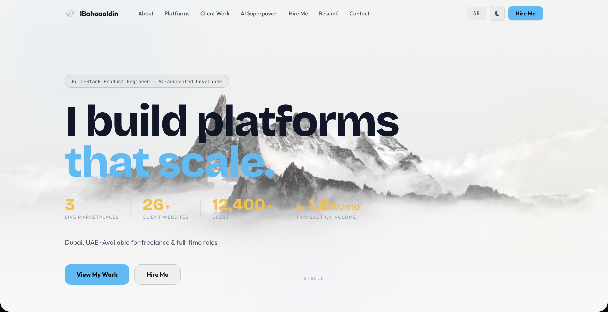

# IBahaaaldin Portfolio Website





A modern, responsive personal portfolio website for **Bahaa Mohammed** — a Full-Stack Product Engineer and AI-Augmented Developer based in Dubai, UAE, with 3+ years shipping production marketplaces, SaaS platforms, and web applications.

---

## About the Developer

**Bahaa Mohammed** is a Full-Stack Developer and AI-Augmented Engineer currently pursuing a B.Sc. in Computer Science — Artificial Intelligence (3.7 GPA) at the British University in Dubai. He has delivered systems serving 12,400+ users with 1.8M AED/month in transaction volume across 26+ client deployments, using Python, JavaScript, React, Next.js, Java, and SQL. Expert-level daily use of AI development tools: Claude Code, ChatGPT, Gemini, GitHub Copilot, and Cursor. Fluent in English and Arabic. Seeking full-time and freelance opportunities in UAE and remotely.

**Personal Details:**
- Nationality: Syrian · Visa: UAE Resident (Family)
- DOB: 15 Sep 2005 · Age 20
- Driving License: UAE Valid

---

## Impact

| Metric | Value |
|--------|-------|
| Monthly transaction volume | 1.8M AED |
| Platform users | 12,400+ |
| Client websites delivered | 26+ |
| University GPA | 3.7 / 4.0 |

---

## Website Overview

This website showcases:

- Professional biography and downloadable CV
- Production projects and live deployment links
- Academic projects and coursework
- GitHub integration and contact form
- Responsive dark/light theme switch
- Deployed via GitHub Pages

---

## Features

- Dark and Light modes with toggle
- Projects section with live links and screenshots
- ATS-friendly resume section (text + downloadable PDF)
- Contact form using Formspree
- GitHub stats and contribution snake

---

## Tech Stack

**Languages:** Python, JavaScript, Java, HTML5, CSS3, SQL, PHP

**Frameworks:** React, Next.js, Node.js, Tailwind CSS, Java Swing, Tkinter

**Tools:** Git, GitHub, Figma, REST APIs, JSON, Formspree

**AI Tools:** Claude, Claude Code, ChatGPT, Gemini, Grok, GitHub Copilot, Cursor

**Specialties:** Marketplace development, SaaS dashboards, multi-role systems, payment integration, bilingual EN/AR web apps, admin panels, UI/UX design

---

## Key Projects

### CarzUAE
Verified UAE vehicle marketplace with 12,400+ users, dealer subscription tiers, car history reports, and WhatsApp integration. Built on Next.js/React.
- Live: [carzuae.app](https://carzuae.app/en)

### Designers Puzzle
Multi-role design services marketplace with escrow payments, 2,347+ verified reviews (4.8/5 rating), and 1.8M AED/month transaction volume.
- Live: [designerspuzzle.com](https://designerspuzzle.com)

### DeluxeLube Platform
Corporate product catalog and admin CMS for Deluxe Lubricants International, serving customers across 50+ countries. Full product management, catalog control, and customer tracking.
- Live: [deluxelube.com](https://deluxelube.com)

### 26+ Restaurant Websites
Production websites for UAE restaurants across Dubai and Sharjah — all bilingual (EN/AR) with admin dashboards and menu management systems.
- Example: [hamasatburger.com](https://hamasatburger.com)

---

## Academic Projects

### School Management System — BUiD Coursework
British University in Dubai · Java, OOP, SQL, Swing GUI
- Multi-role academic management system (admin, teacher, student) with grade tracking, timetable, and reporting
- OOP design patterns (inheritance, polymorphism); JDBC database integration; Java Swing GUI

### Database Systems Design — BUiD Coursework
British University in Dubai · SQL, ER Modeling, Normalization
- Normalized relational schemas (3NF/BCNF), ER modeling, SQL query optimization, stored procedures

---

## Certifications & Learning

**Professional Certifications — In Progress (2026)**
Actively completing certifications in AI & Machine Learning, Cloud Computing, and Data Science across major online platforms.

**Applied AI Development**
Daily professional use of Claude Code, ChatGPT, Gemini, GitHub Copilot, and Cursor — expertise built through 3 production platforms and 26+ client websites.

---

## Screenshots


---

## Folder Structure

```
IBahaaaldin.github.io/
├── docs/                              # Main website folder
│   ├── assets/                        # Images and branding
│   │   ├── Portfolio_banner.png       # Custom banner for GitHub/landing
│   │   ├── Website_preview.jpeg       # Website preview for README
│   │   ├── Logo.png                   # Site logo used in navbar/head
│   │   ├── Image.jpeg                 # Additional image (e.g. About section)
│   │   └── Image2.jpeg                # Additional image (e.g. Projects section)
│   │
│   ├── css/                           # Styling folder
│   │   └── styles.css                 # Main CSS file for theming/layout
│   ├── js/                            # Scripting folder
│   │   └── scripts.js                 # Main JS file for functions
│   │
│   └── index.html                     # Portfolio website main page
│
├── LICENSE                            # License file (MIT)
└── README.md                          # Project overview and structure
```

---

## Live Demo

[Visit Website](https://ibahaaaldin.github.io)

---

## Contact

- **Email**: Bahaam.coding@gmail.com
- **LinkedIn**: [linkedin.com/in/ibahaaaldin](https://www.linkedin.com/in/ibahaaaldin)
- **GitHub**: [github.com/IBahaaaldin](https://github.com/IBahaaaldin)
- **Location**: Dubai, UAE · +971 54 321 4323

---

## Languages

- **Arabic** — Native speaker
- **English** — Fluent (professional)

---

## License

This project is licensed under the MIT License.
