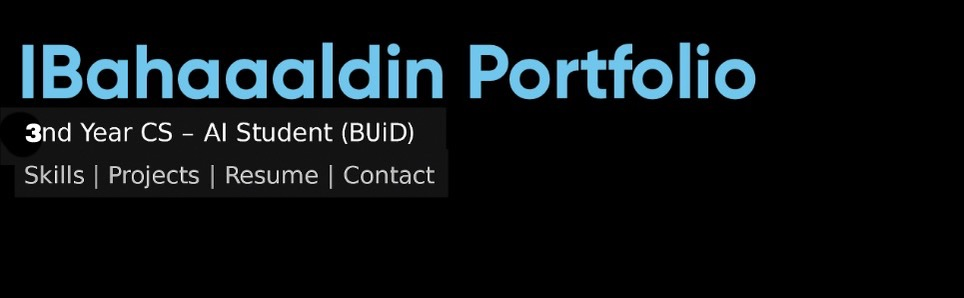

# 🌐 IBahaaaldin Portfolio Website




A modern, responsive personal portfolio website for IBahaaaldin — a second-year Computer Science – AI student passionate about AI solutions, system building, and creating efficient tools.

---

## 👨‍💻 About the Developer

**IBahaaaldin** is a Computer Science – AI student at the British University in Dubai. With strong interests in AI, system design, and productivity tools, he builds software projects using Python, Java, HTML, and JavaScript, focusing on real-world usability and clean UI/UX.

---

## 🧭 Website Overview

This website showcases:

- Personal biography and resume
- Academic and programming projects
- GitHub integration and contact form
- Responsive dark/light theme switch
- Deployed via GitHub Pages

---

## ✨ Features

- 🌗 Dark and Light modes with toggle
- 🧩 Projects section with links and screenshots
- 📄 ATS-friendly résumé section (text + downloadable PDF)
- 💬 Contact form using Formspree
- 🖼️ GitHub stats and contribution snake

---

## 📷 Screenshots


---

## 📂 Folder Structure

```
IBahaaaldin.github.io/
├── docs/                              # Main website folder
│   ├── assets/                        # Images and branding
│   │   ├── Portfolio_banner.png       # Custom banner for GitHub/landing
│   │   ├── Website_preview.jpeg       # Website preview for README
│   │   ├── Logo.png                   # Site logo used in navbar/head
│   │   ├── Image.jpeg                 # Additional image (e.g. About section)
│   │   └── Image2.jpeg                # Additional image (e.g. Projects section)
│   │
│   ├── css/                           # Styling folder
│   │   └── styles.css                 # Main CSS file for theming/layout
│   ├── js/                            # Scripting folder
│   │   └── scripts.js                 # Main JS file for functions
│   │
│   └── index.html                     # Portfolio website main page
│
├── LICENSE                            # License file (e.g., MIT)
└── README.md                          # Project overview and structure
```

---

## 🔗 Live Demo

👉 [Visit Website](https://ibahaaaldin.github.io)

---

## 🛠 Projects Highlighted

- ✅ [To-Do App (Java)](https://github.com/IBahaaaldin/To-Do-App-java)
- ✅ [To-Do App (Python)](https://github.com/IBahaaaldin/To-Do-App-python)
- ✅ [GPA Calculator (Python)](https://github.com/IBahaaaldin/GPA-Calculator-python)

Each includes:

- Project summary
- Screenshot preview
- GitHub repository links

---

## 📬 Contact

- **Email**: bahaam.coding@gmail.com
- **LinkedIn**: [linkedin.com/in/bahaa-mohammed-371259369](https://www.linkedin.com/in/ibahaaaldin)
- **Instagram**: [@ibahaaaldin](https://www.instagram.com/bahaam.coding)

---

## 📄 License

This project is licensed under the MIT License.
